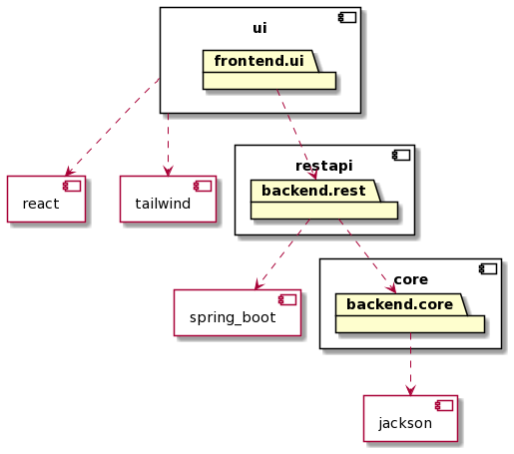

# Group project GR21 29

## About the app

We are making an app for renting houses. A user should be able to register/log in and then see available houses. The user can then contact the owner. Additionally, the user can add his own house to the app and rent it by changing the availability or delete the house.

Our code is divided into our backend and frontend folders. Backend consists of the domain and rest-api written in java. Frontend is written in react. See their respective readmes for more information.

Our code is inside of "housing", and is divided with a three layer arcitecture, with maps for Json, Main and UI. More information about the aplication is in the readme-file inside of housing. The test-folders contain all the information about the test. See the ui-testing branch for information about the ui-tests and the tests as far as we have them.

You are able to create a user from the dashboard and then log into that user later on. With that user you can post and delete houses for rent, and se other users houses.

## How to run

- How to run frontend: [frontend/readme.md](frontend/readme.md)
- How to run backend: [backend/readme.md](backend/readme.md)

## Tools for testing code quality

- Prettier: in frontend prettier makes sure that code is properly formatted.
- Checkstyle: checks that our source code corresponds to java standards
- Jacoco: gives us test-covereage as percentage

## Architecture

The application is divided into backend and frontend folder. Frontend is a create-react-app project which used react and tailwind. Backend is a multi-module maven project which is divided into the following modules:

core - contains the domain-layer of the application.

rest - contains our rest-api which connects our frontend to our backend

The core module consits of multiple classes, implementing the core logic for the applications functionality. Since most methods in these classes Due to most classes in core are public, they can be called upon in our rest module.

See image for illustation of the architecture of the modules.  

